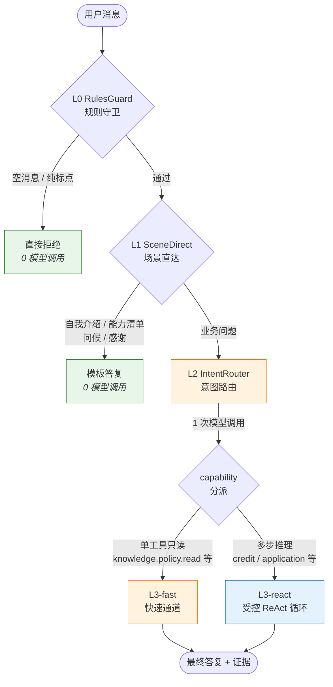
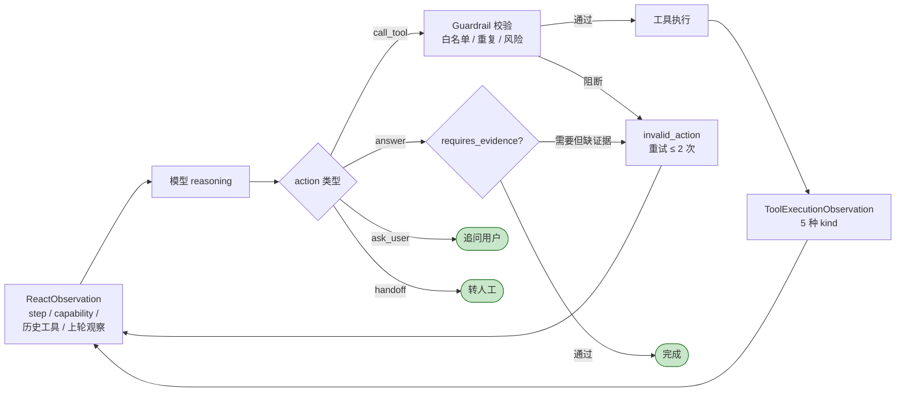
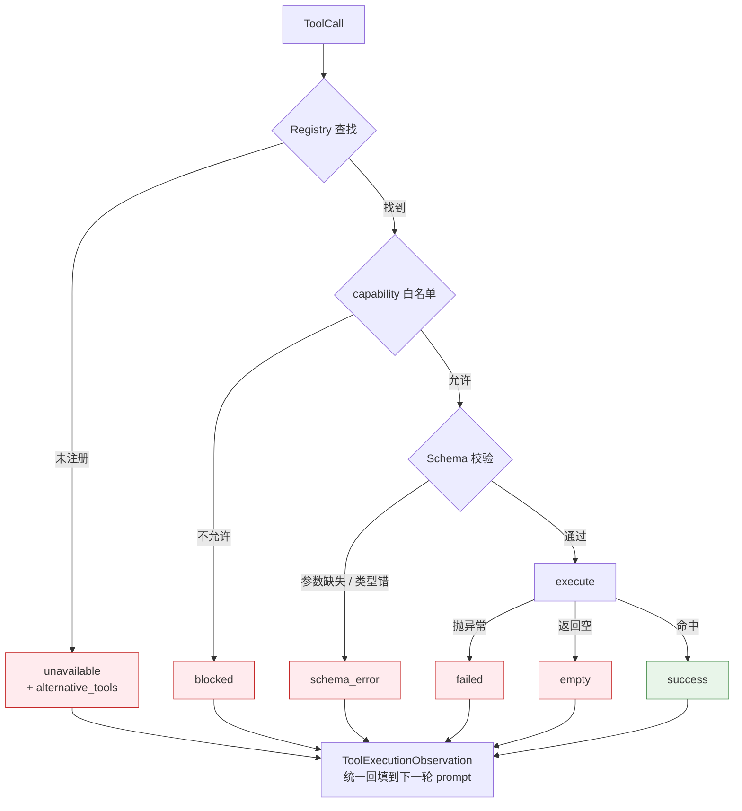

# 信易贷智能业务助手 · 受控 ReAct Agent

面向**金融封闭业务域**的 LLM Agent。在政策问答、授信查询、申请受理等场景下，从协议层而非 prompt 层封死幻觉与失控风险。

---

## 一、背景

信易贷是面向中小微企业的融资业务平台。早期的 Agent 入口存在四类问题：

- **幻觉**：用户问"小微税贷利率多少"时，模型可能编造一个"年化 4.5%"，金融场景下属于合规事故
- **失控**：模型可以自由调用任意工具、传任意参数；高风险动作（生成授权链接、提交申请草稿）缺少强制确认
- **不可审计**：一次对话经历过哪些路由判断、调用了哪些工具、引用了哪些证据，事后无法追溯
- **响应慢**：所有请求都过 LLM，包括"你好"这种闲聊也消耗 5+ 秒

第一版采用模型自由 ReAct（类似 LangChain 默认实现）后，这些问题靠 prompt 工程无法根治。

本项目是第二版重构，**核心思路是把模型的自由度尽可能下放到协议**：模型每轮只能在受限的 action 集合里做选择，工具白名单由 capability 派生，回答必须基于可引用的证据。

---

## 二、设计思想

四条贯穿全项目的原则：

### 1. 协议先行

数据契约用 `pydantic` `frozen=True` + `extra="forbid"` 锁死。模型每轮 reasoning 的输出只能是 4 种 action 之一（`call_tool / answer / ask_user / handoff`），违反 schema 直接重试或转人工。**模型不能自由生成自然语言再调工具**。

### 2. 分级路由

把请求按"是否需要 LLM"切分为四层。约 30% 的高频请求（空消息、自我介绍、问候、能力清单）在 L0 / L1 短路返回，0 模型调用；只有真正的业务问题才走 L2 路由 + L3 ReAct。

### 3. fail-closed 工具系统

`ToolSpec` 的 `is_read_only / is_idempotent / is_concurrency_safe` 默认为 `False`——工具必须**显式声明**才能进入只读快速通道、被并发调度、或被自动重试。所有失败模式（unavailable / blocked / failed / empty / schema_error）统一封装为结构化 observation 喂回模型，**禁止异常穿透主循环**。

### 4. 反幻觉护栏

- `CapabilityPolicy.requires_evidence=True` 时，answer 必须填 `evidence_used` 引用 source
- 同 `(tool_name, arguments)` 重复调用 ≥ 2 次硬阻断
- `max_react_steps` 兜底强制 `ask_user`，**不允许 LLM 自由生成**整段答案
- 高风险动作（state_create / link_create / final_submit）转 `pending_action` 等待用户显式确认

---

## 三、整体架构



---

## 四、ReAct 单步流程

主循环每一步都是"**模型推理 → 规则护栏 → 工具执行 → 观察封装**"四阶段。模型没有任何"自由发挥"的空间，每一步都被规则裁决。



---

## 五、工具失败处理

工具调用的所有失败路径都收敛为结构化 observation，**没有任何异常会穿透主循环**。这是反幻觉的关键——模型必须看见"工具失败了"这件事，而不是"工具沉默"。



---

## 六、项目结构

```text
src/xinyidai_agent/
├── protocol.py                 # 全部数据契约（pydantic frozen + extra="forbid"）
├── react_observation.py        # 模型每轮 reasoning 的输入快照协议
├── api.py                      # FastAPI 入口 + 生命周期管理
│
├── capabilities/               # 能力层
│   ├── base.py                 #   CapabilityPolicy（含 fast_path_eligible / requires_evidence / max_react_steps）
│   ├── catalog.py              #   8 条 capability 显式声明
│   └── resolver.py             #   standard_intent + scene → capability
│
├── router/                     # 路由层
│   ├── rules_guard.py          #   L0 规则守卫
│   ├── scene_direct.py         #   L1 场景直达
│   ├── model_router.py         #   L2 模型意图路由（受限 standard_intent 枚举）
│   └── service.py              #   ControlledIntentRouter 编排
│
├── runtime/                    # 主循环
│   ├── react_loop.py           #   ReactRuntime 主编排器
│   ├── react_engine.py         #   单步 reason + guardrail + execute
│   ├── react_prompt.py         #   注入 schema 与 capability 约束的 prompt
│   ├── react_observation_builder.py
│   ├── fast_path.py            #   L3 单工具快速通道
│   └── __init__.py             #   ControlledAgentLoop 对外兼容 facade
│
├── tools/                      # 工具层（fail-closed）
│   ├── base.py                 #   ToolSpec（is_read_only / is_idempotent / cost_class）
│   ├── registry.py             #   ToolRegistry.execute_observed
│   ├── rag_search.py           #   RAG 检索工具（真实接入）
│   └── mock_credit.py          #   授信查询工具（mock）
│
├── rag/                        # RAG 检索层
│   ├── factory.py              #   生产运行时工厂（embedder / retriever / reranker）
│   ├── async_runtime.py        #   后台线程独占 event loop，解决跨循环冲突
│   ├── embedder.py             #   BGE 向量化
│   ├── retriever.py            #   Hybrid 检索 + RRF 融合
│   ├── reranker.py             #   CrossEncoder 重排
│   └── storage.py              #   pgvector 存储
│
├── memory.py                   # 会话状态 / 短期记忆
├── pending_actions.py          # 高风险动作的待确认管理
└── evidence_policy.py          # 引用与证据校验

test/
├── contract/                   # 协议契约测试（70+ 用例）
├── smoke/                      # 冒烟（百炼连通性 / 性能基线）
├── e2e/                        # 端到端（11 query 路径矩阵 + 反幻觉专项）
└── evaluation/                 # 离线质量评测（RAG / Agent 行为 / DeepEval 用例）

docs/design/
├── AGENT_RUNTIME_REACT_DESIGN.md            # 设计文档（12 章）
└── AGENT_RUNTIME_REACT_IMPLEMENTATION_CHECKLIST.md  # 实施清单（9 Phase）
```

---

## 七、关于工具实现

业务工具的接口源自实习公司内部 Java 后端，**不能对外披露真实 endpoint**，因此 `mock_credit.py` 等工具的 `execute()` 使用模拟数据。

需要说明的是：本项目的全部架构机制（协议层、4 层路由、ReAct 受控循环、反幻觉护栏、fail-closed 工具系统），都是为"**当工具不可信、不可用、被阻断时如何安全降级**"而设计——这是金融封闭域 Agent 真正难的部分。工具切换为真实 HTTP 调用只需替换 `execute()` 方法，主循环不需要任何改动。

---

## 八、质量评测

仓库中保留了三层质量验证，目的与边界差别比较大：

| 层 | 位置 | 目的 | 当前状态 |
|---|---|---|---|
| 契约测试 | `test/contract/` | 锁死协议、护栏、fail-closed 行为 | 主力，PR 必跑 |
| 冒烟 / E2E | `test/smoke/` `test/e2e/` | 真实链路连通、路径矩阵、反幻觉专项 | 主力，连通后跑 |
| 离线评测 | `test/evaluation/` `src/xinyidai_agent/evaluation/` | RAG 召回质量、答案忠实度、Agent 行为指标 | **未对齐生产**，仅作骨架 |

`test/evaluation/test_deepeval_agent.py` 当前用 `Hallucination` 指标对受控降级文案打分会被 LLM judge 误判（指标语义假定 Agent 已经看到 context，但当前业务工具尚未接真实后端，Agent 故意按"无证据则拒答"的契约降级）。这部分**不是 Agent 的失败，是评测姿势与运行时设计错位**。

可演进的扩展思路（不在当前阶段实施）：

- 数据集：`golden / regression / replay / adversarial` 四类按场景分桶版本化
- 指标：retrieval 用 RAGAS、generation 用 faithfulness、agent 用 trajectory + 拒答正确率、运行成本/延迟独立成层
- Runner：现有 pytest + `RAGEvaluator` 保留作单元层；如需更完整的 trace + scorer，引入 Inspect AI 或 promptfoo 作 runner，DeepEval 仅当指标实现器
- 闭环：在线 trace 采样 → 异步 judge → 失败回灌 regression；judge 本身需要定期人工 meta-eval 校准

落到生产前需要先解决的最小动作：把"工具是否就绪 / 是否走降级"作为评测维度独立出来，避免 hallucination 指标被降级文案污染。

---

## 九、设计文档导航

更详细的设计推导和实现细节见：

- [`docs/design/AGENT_RUNTIME_REACT_DESIGN.md`](docs/design/AGENT_RUNTIME_REACT_DESIGN.md)：12 章设计文档，含 claude-code 主循环工程实践分析与本项目落地方案
- [`docs/design/AGENT_RUNTIME_REACT_IMPLEMENTATION_CHECKLIST.md`](docs/design/AGENT_RUNTIME_REACT_IMPLEMENTATION_CHECKLIST.md)：9 个执行 Phase + 12 条不变量自检 + 9 条禁忌清单
- [`docs/design/RAG_SYSTEM_PRODUCTION_IMPLEMENTATION_CHECKLIST.md`](docs/design/RAG_SYSTEM_PRODUCTION_IMPLEMENTATION_CHECKLIST.md)：RAG 生产级落地清单
- [`docs/2026-05-09-RAG接入与意图识别问题排查报告.md`](docs/2026-05-09-RAG接入与意图识别问题排查报告.md)：第一版幻觉与路由问题的定位过程，是本次重构的直接动机
